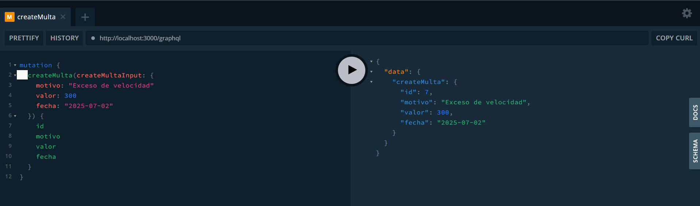
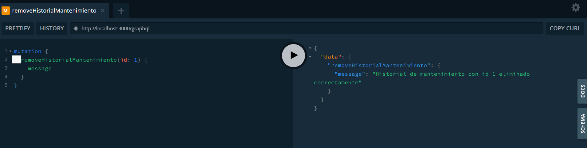
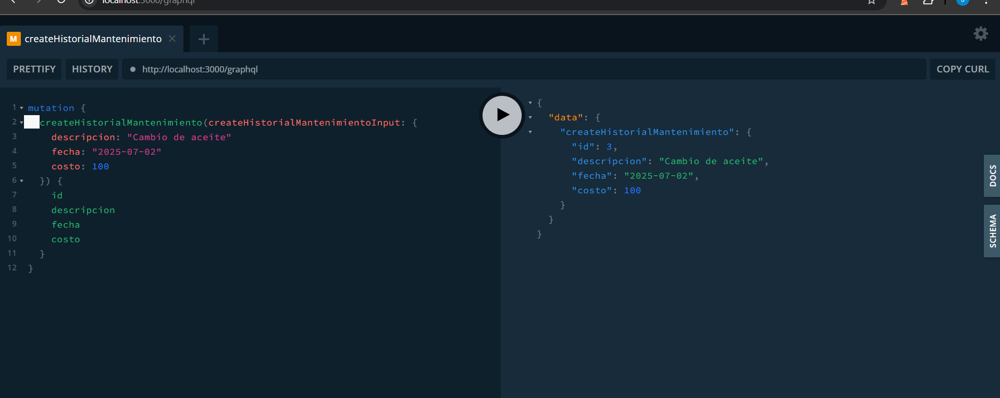
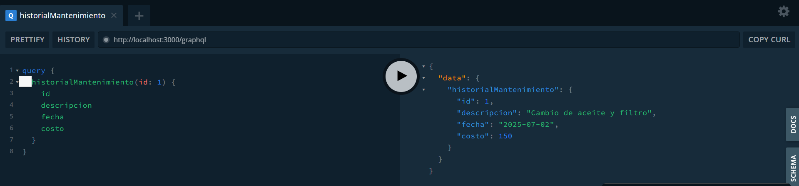
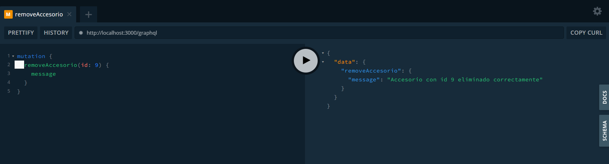
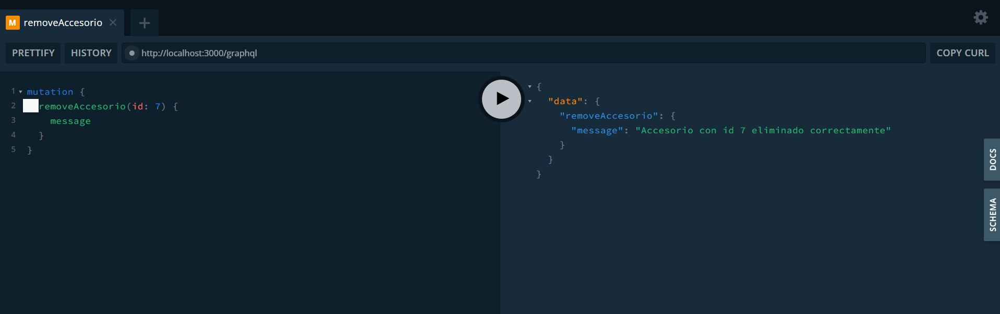
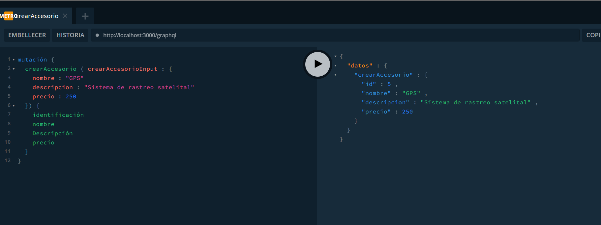

# Practica 2 - API GraphQL con NestJS

## Entidades implementadas
- Accesorios
- Historial de Mantenimiento
- Multas

## Instalación

```bash
git clone <URL_DEL_REPOSITORIO>
cd practica2-graphql
npm install
npm run start:dev
Imagenes

 









